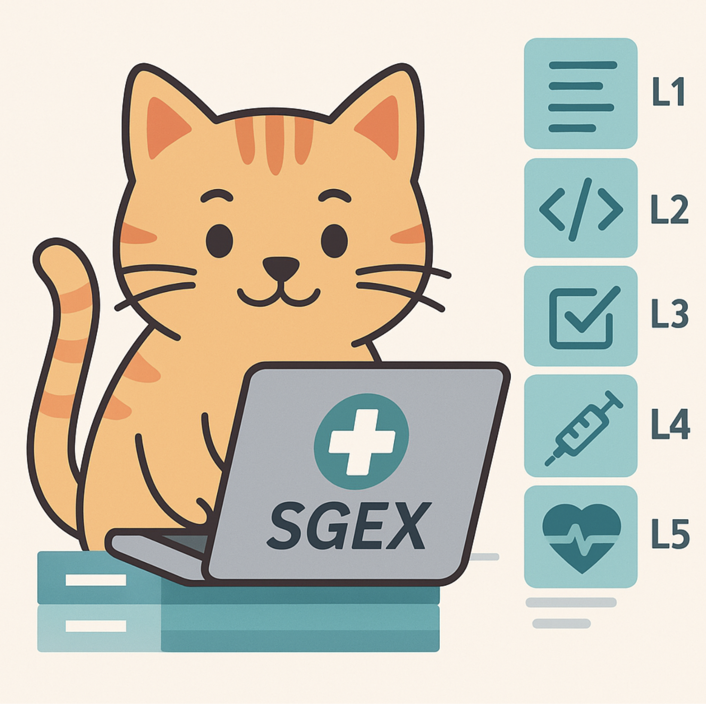

# SGEX Workbench (WHO SMART Guidelines Exchange)

<div align="center">
  
  <p><em>Meet your SGEX Workbench Helper - here to guide you through WHO SMART Guidelines DAK editing!</em></p>
</div>

## Mission Statement

SGEX is an experimental collaborative project developing a workbench of tools to make it easier and faster to develop high fidelity SMART Guidelines Digital Adaptation Kits (DAKs). Our mission is to empower healthcare organizations worldwide to create and maintain standards-compliant digital health implementations through:

- **Collaborative Development**: Every contribution matters, whether reporting bugs, testing features, or sharing feedback
- **AI-Powered Assistance**: Hybrid approach combining human insight with AI coding agents for efficient development
- **Community-Driven Evolution**: Real-time improvement through collaborative discussion and iterative refinement
- **Real-World Impact**: Building tools that help healthcare workers worldwide deliver better patient care

## How to Contribute

Contributing to SGEX is a collaborative journey that combines human creativity with AI assistance:

1. **🐛 Start with Feedback**: Report bugs, request features, or suggest improvements through our issue tracker
2. **🤖 AI-Powered Development**: Issues may be assigned to coding agents for initial analysis and implementation
3. **🌟 Community Collaboration**: The community reviews, tests, and refines changes through collaborative discussion
4. **🚀 Real-Time Evolution**: The workbench continuously evolves based on actual usage and feedback from healthcare professionals

Every contribution helps improve digital health tools for healthcare workers worldwide. Whether you're reporting a bug, testing a feature, or sharing feedback, you're part of building the future of digital health tooling.

**Ready to contribute?** Visit our [landing page](https://litlfred.github.io/sgex/) to get started or use the help mascot on any page to quickly report issues.

This repository contains the source code, schemas, and documentation for the SGEX Workbench—a browser-based, standards-compliant collaborative editor for WHO SMART Guidelines Digital Adaptation Kits (DAKs).

## Overview

The SGEX Workbench provides an intuitive interface for collaborative editing of WHO SMART Guidelines Digital Adaptation Kits (DAKs). Here's what you can expect:

### Repository Selection
Browse and select from available DAK repositories with enhanced scanning display showing repository details, tags, and metadata.


### DAK Component Management
Access and edit the 8 core DAK components organized according to the WHO SMART Guidelines framework, including Health Interventions, Generic Personas, User Scenarios, Business Processes, Core Data Elements, Decision-Support Logic, Program Indicators, and Requirements.


## About

The SGEX Workbench is a browser-based, static web application for collaborative editing of WHO SMART Guidelines Digital Adaptation Kits (DAKs) content stored in GitHub repositories.

- All UI schemas are rendered using [JSON Forms](https://jsonforms.io/) for standards compliance and accessibility.
- All schemas and documentation follow the terminology and branding of [WHO SMART Guidelines](https://www.who.int/teams/digital-health-and-innovation/smart-guidelines).

## Development Setup

### Prerequisites

- **Node.js**: Version 16.x or higher (tested with Node.js 18.x and 20.x)
- **npm**: Version 8.x or higher (comes with Node.js)

### Installation

1. **Clone the repository**
   ```bash
   git clone https://github.com/litlfred/sgex.git
   cd sgex
   ```

2. **Install dependencies**
   ```bash
   npm install
   ```

3. **Authentication Setup**
   
   SGEX Workbench uses GitHub Personal Access Tokens (PATs) for authentication. No additional setup is required - the application will guide you through creating a PAT when you first sign in.
   
   **Note**: The app will show helpful step-by-step instructions for creating a Personal Access Token when you try to sign in.

### Development

1. **Start the development server**
   ```bash
   npm start
   ```
   The application will be available at `http://localhost:3000/sgex`

2. **Build for production**
   ```bash
   npm run build
   ```
   The build artifacts will be created in the `build/` directory.

3. **Run tests**
   ```bash
   npm test
   ```
### Docker

1. **Build the docker image**
```bash
docker build -t sgex .
```

2. **Start the docker image**
```bash
docker run --rm -p 3000:3000 sgex
```

## Authentication

SGEX Workbench uses **GitHub Personal Access Tokens (PATs)** for secure authentication. This provides a secure authentication method without requiring any backend server setup.

### How it works:
1. Users click "Sign in with Personal Access Token"
2. The app displays step-by-step instructions for creating a GitHub Personal Access Token
3. Users create their PAT with the required permissions and paste it into the app
4. The app stores the token securely in the browser and loads the user's repositories

### Required GitHub Permissions:
For **fine-grained tokens**:
- **Contents**: Read and Write (for editing DAK content)
- **Metadata**: Read (for repository information)
- **Pull requests**: Read and Write (for creating pull requests)

For **classic tokens**:
- **repo**: Full control of private repositories (for editing DAK content)
- **read:org**: Read org and team membership (for listing organization repositories)

This authentication method is fully compatible with static deployments and requires no backend server.

### Project Structure

```
sgex/
├── public/          # Static assets
├── src/             # Source code
│   ├── components/  # React components
│   ├── App.js       # Main application component
│   └── index.js     # Application entry point
├── public/docs/     # Project documentation
├── package.json     # Dependencies and scripts
└── README.md        # This file
```

### Available Scripts

- `npm start` - Runs the app in development mode
- `npm test` - Launches the test runner in interactive watch mode
- `npm run build` - Builds the app for production
- `npm run eject` - **Note: This is a one-way operation. Don't do this unless you know what you're doing!**

### Troubleshooting

- **Port 3000 already in use**: The development server will automatically try to use an alternative port (3001, 3002, etc.)
- **Build issues**: Try deleting `node_modules/` and `package-lock.json`, then run `npm install` again
- **Memory issues**: If you encounter JavaScript heap out of memory errors, try setting `NODE_OPTIONS=--max-old-space-size=4096` before running build commands

For more information about contributing, see [CONTRIBUTING.md](CONTRIBUTING.md).

## WHO SMART Guidelines DAK Components

The SGEX Workbench supports editing of the **8 core Digital Adaptation Kit (DAK) components** as defined by the WHO SMART Guidelines framework. These components are organized according to the official DAK authoring sequence:

### The 8 Core DAK Components
1. **Health Interventions and Recommendations** - Clinical guidelines and health intervention specifications
2. **Generic Personas** - Standardized user roles and actor definitions  
3. **User Scenarios** - Narrative descriptions of user interactions with the system
4. **Generic Business Processes and Workflows** - BPMN workflows and business process definitions
5. **Core Data Elements** - Essential data structures and terminology for clinical data
6. **Decision-Support Logic** - DMN decision tables and clinical decision support
7. **Program Indicators** - Performance indicators and measurement definitions
8. **Functional and Non-Functional Requirements** - System requirements and specifications

### Additional Components
The SGEX Workbench also supports additional structured knowledge representations including Terminology, FHIR Profiles, FHIR Extensions, FHIR Questionnaires, and Test Data & Examples.

For detailed information about each component, see the [DAK Components Documentation](public/docs/dak-components.md).

*Note: Scheduling tables are considered a special case of decision tables and are included within the Decision Support Logic component.*

For more information on DAK authoring, see the [WHO SMART Guidelines IG Starter Kit](https://smart.who.int/ig-starter-kit/l2_dak_authoring.html).

## Deployment

This app is designed for deployment on **GitHub Pages** in the gh-pages branch of the smart-base repo. Currently the gh-pages branch deploys to https://worldhealthorganization.github.io/smart-base/ when in draft and http://smart.who.int when published. Publishing is handled by the IG publisher https://github.com/HL7/fhir-ig-publisher

## Documentation

All project documentation is located in the `public/docs/` directory:

- [Project Plan](public/docs/project-plan.md) - Overall project planning and milestones
- [Requirements](public/docs/requirements.md) - Detailed functional and non-functional requirements
- [Solution Architecture](public/docs/solution-architecture.md) - Technical architecture and design decisions
- [DAK Components](public/docs/dak-components.md) - Comprehensive guide to the 8 WHO SMART Guidelines DAK components

## License

This project is licensed under the Apache License 2.0 - see the [LICENSE](LICENSE) file for details.

## References

- [WHO SMART Guidelines](https://www.who.int/teams/digital-health-and-innovation/smart-guidelines)
- [JSON Forms](https://jsonforms.io/)
- [bpmn-js](https://github.com/bpmn-io/bpmn-js)
- [dmn-js](https://github.com/bpmn-io/dmn-js)
- [Octokit](https://github.com/octokit/rest.js)
- [GitHub REST API](https://docs.github.com/en/rest)
