# SGEX Deployment Workflows and File Distribution Analysis

## Overview
This document provides a comprehensive analysis of how SGEX deploys across different scenarios and how the critical files (`index.html` and `404.html`) are distributed and function in each deployment type.

## Deployment Architecture Overview

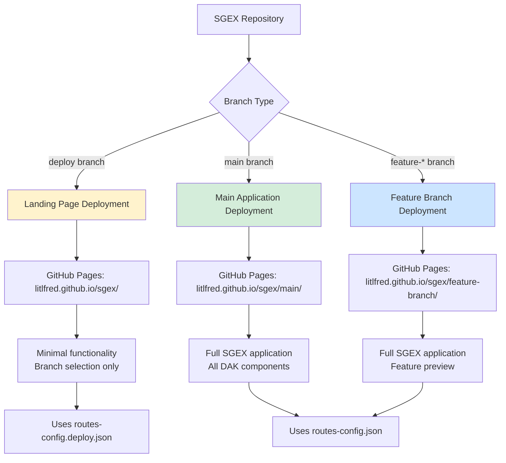

## Detailed Deployment Scenarios

### 1. Landing Page Deployment (Deploy Branch)

**Location**: `https://litlfred.github.io/sgex/`
**Source Branch**: `deploy`
**Purpose**: Minimal entry point for branch selection

#### File Structure:
```
/sgex/
├── index.html                 # Main React app entry point
├── 404.html                   # Routing fallback for all URLs
├── routeConfig.js             # Route configuration loader
├── routes-config.deploy.json  # Minimal component configuration
├── static/                    # React build assets
│   ├── css/
│   ├── js/
│   └── media/
└── manifest.json             # PWA manifest
```

#### Deployment Workflow:
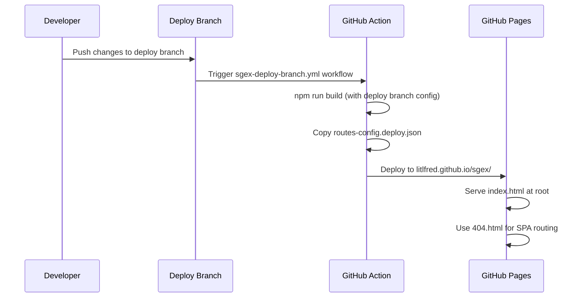

#### Key Characteristics:
- **Limited Functionality**: Only basic branch selection and navigation
- **Simplified Configuration**: Uses `routes-config.deploy.json` with minimal components
- **Entry Point Role**: Primary entry for users to select working branches
- **Static Asset Base**: All assets served from `/sgex/` path

### 2. Main Branch Deployment

**Location**: `https://litlfred.github.io/sgex/main/`
**Source Branch**: `main`
**Purpose**: Full production application

#### File Structure:
```
/sgex/main/
├── index.html                 # Full React app entry point
├── 404.html                   # Routing fallback (same as deploy)
├── routeConfig.js             # Route configuration loader
├── routes-config.json         # Full component configuration
├── static/                    # React build assets
│   ├── css/
│   ├── js/
│   └── media/
└── manifest.json             # PWA manifest
```

#### Deployment Workflow:
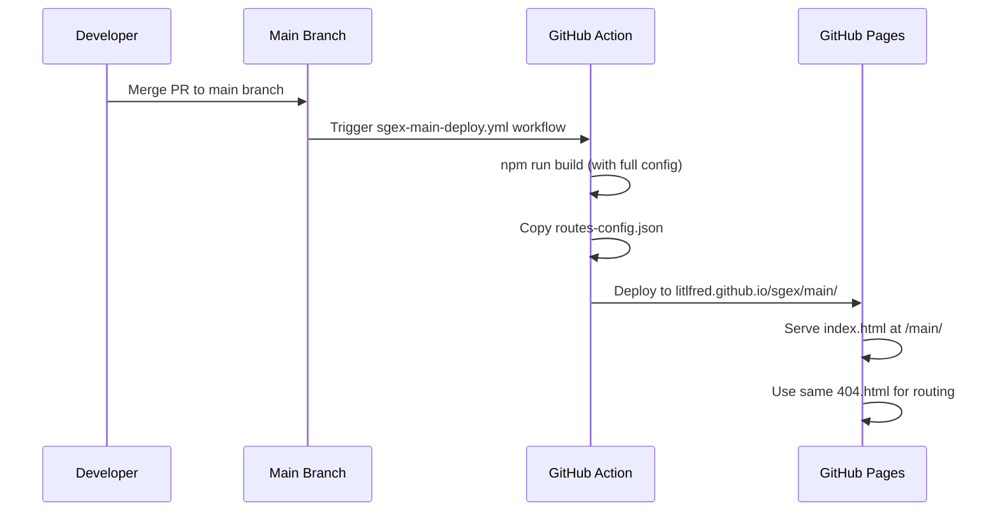

#### Key Characteristics:
- **Full Functionality**: All DAK components and features available
- **Complete Configuration**: Uses `routes-config.json` with all components
- **Production Environment**: Stable, tested version of the application
- **Shared 404.html**: Uses the same routing logic as deploy branch

### 3. Feature Branch Deployments

**Location**: `https://litlfred.github.io/sgex/{branch-name}/`
**Source Branch**: Any `feature-*` or custom branch
**Purpose**: Preview deployments for development

#### File Structure:
```
/sgex/feature-branch/
├── index.html                 # Full React app entry point
├── 404.html                   # Routing fallback (same as others)
├── routeConfig.js             # Route configuration loader
├── routes-config.json         # Full component configuration
├── static/                    # React build assets
│   ├── css/
│   ├── js/
│   └── media/
└── manifest.json             # PWA manifest
```

#### Deployment Workflow:
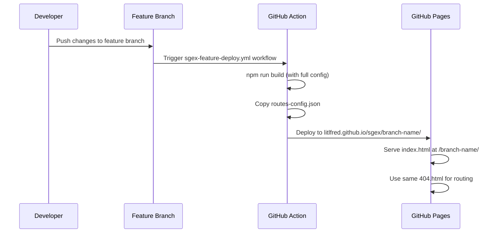

#### Key Characteristics:
- **Development Preview**: Allows testing features before merge
- **Full Functionality**: Same as main branch but isolated
- **Temporary**: May be cleaned up when branch is merged/deleted
- **Independent**: Each feature branch gets its own deployment path

## Critical File Analysis

### index.html Distribution and Function

#### Common Structure Across All Deployments:
```html
<!DOCTYPE html>
<html lang="en">
  <head>
    <meta charset="utf-8" />
    <title>SGEX Workbench</title>
    <!-- Security headers -->
    <!-- Load SGEX route configuration service -->
    <script src="./routeConfig.js"></script>
  </head>
  <body>
    <div id="root"></div>
    <!-- React app bundle scripts injected here by build process -->
  </body>
</html>
```

#### Deployment-Specific Differences:

| Aspect | Deploy Branch | Main Branch | Feature Branch |
|--------|---------------|-------------|----------------|
| **Base Path** | `/sgex/` | `/sgex/main/` | `/sgex/branch-name/` |
| **Asset Paths** | `./static/` | `./static/` | `./static/` |
| **Route Config** | `./routeConfig.js` | `./routeConfig.js` | `./routeConfig.js` |
| **Bundle Size** | Minimal | Full | Full |
| **Component Access** | Limited | Complete | Complete |

### 404.html Distribution and Function

#### Universal 404.html Strategy:
The 404.html file is **identical across all deployments** and contains the complete routing logic to handle any URL pattern.

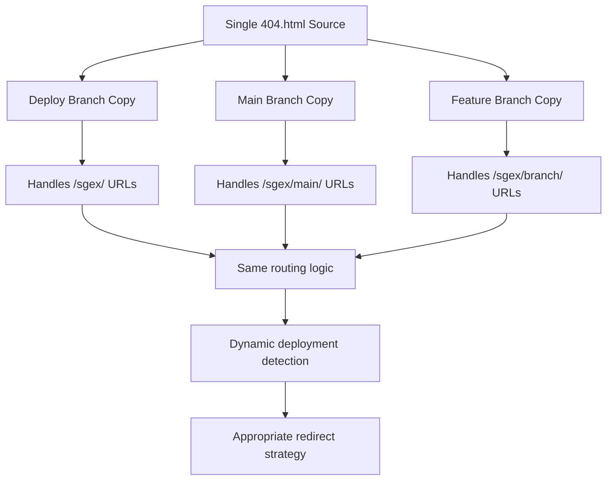

#### 404.html Deployment Detection Logic:
```javascript
// Deployment type detection in 404.html
function detectDeploymentType(pathSegments, hostname) {
  if (hostname.endsWith('.github.io')) {
    if (pathSegments[0] === 'sgex') {
      if (pathSegments.length === 1) return 'landing';
      if (pathSegments[1] === 'main') return 'main';
      return 'feature-branch';
    }
  }
  return 'local';
}
```

## Route Configuration System

### Configuration File Distribution:

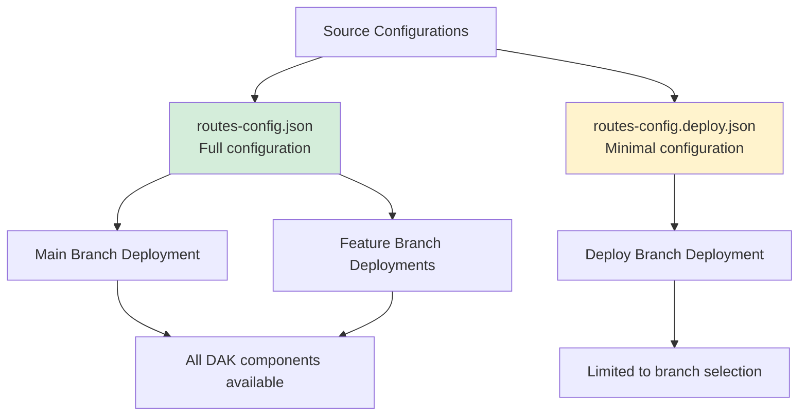

### routeConfig.js Behavior:
```javascript
// Automatic configuration selection
function getDeploymentType() {
  var path = window.location.pathname;
  
  // Check for full feature access
  if (path.includes('/docs/') || path.includes('/dashboard/') || 
      path.includes('/bpmn-') || path.includes('/decision-support-')) {
    return 'main'; // Load routes-config.json
  }
  
  // Root access suggests deploy branch
  if (path === '/' || path === '/sgex/') {
    return 'deploy'; // Load routes-config.deploy.json
  }
  
  return 'main'; // Default to full configuration
}
```

## URL Processing Flow by Deployment

### 1. Landing Page URL Processing:
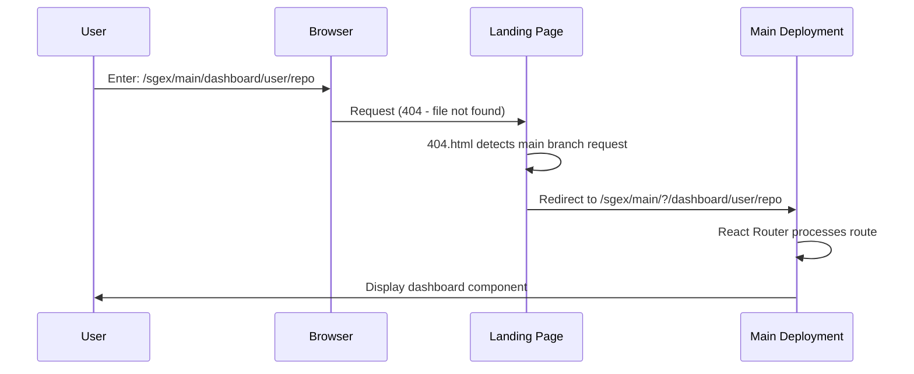

### 2. Main Branch URL Processing:
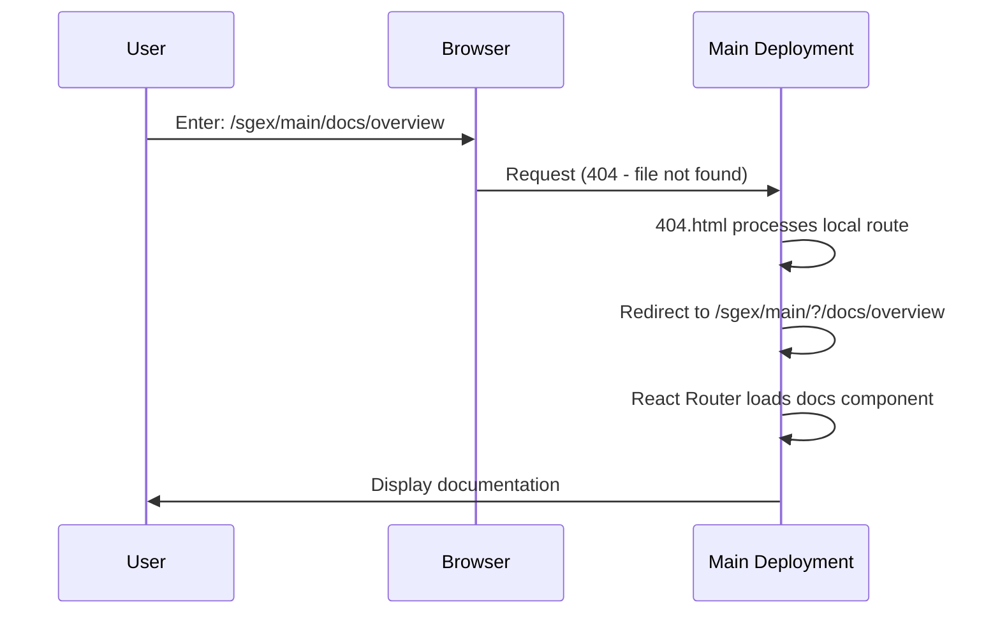

### 3. Feature Branch URL Processing:
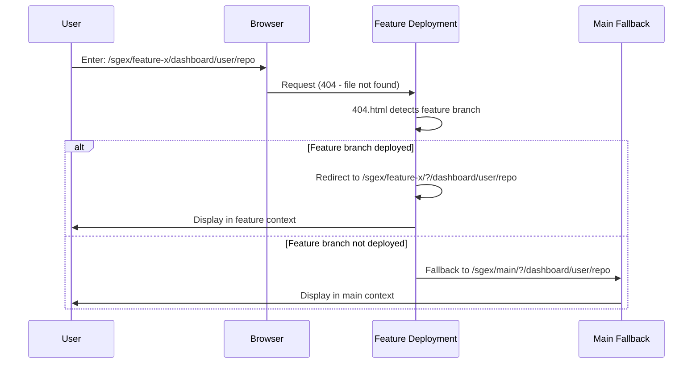

## Asset and Resource Management

### Static Asset Distribution:
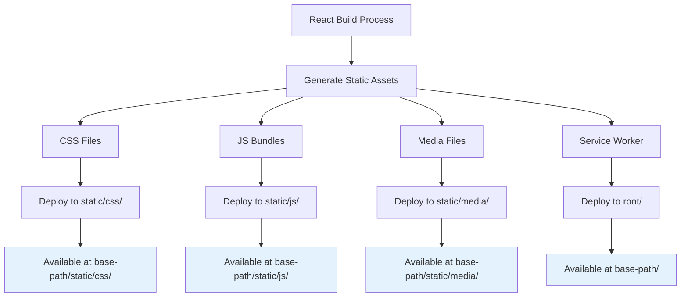

### Cross-Deployment Resource Sharing:
- **404.html**: Identical logic across all deployments
- **routeConfig.js**: Same file, different configuration loading
- **Static Assets**: Independent per deployment to avoid conflicts
- **Configuration Files**: Deployment-specific (deploy vs. full)

## Deployment Coordination and Dependencies

### GitHub Actions Workflow Coordination:
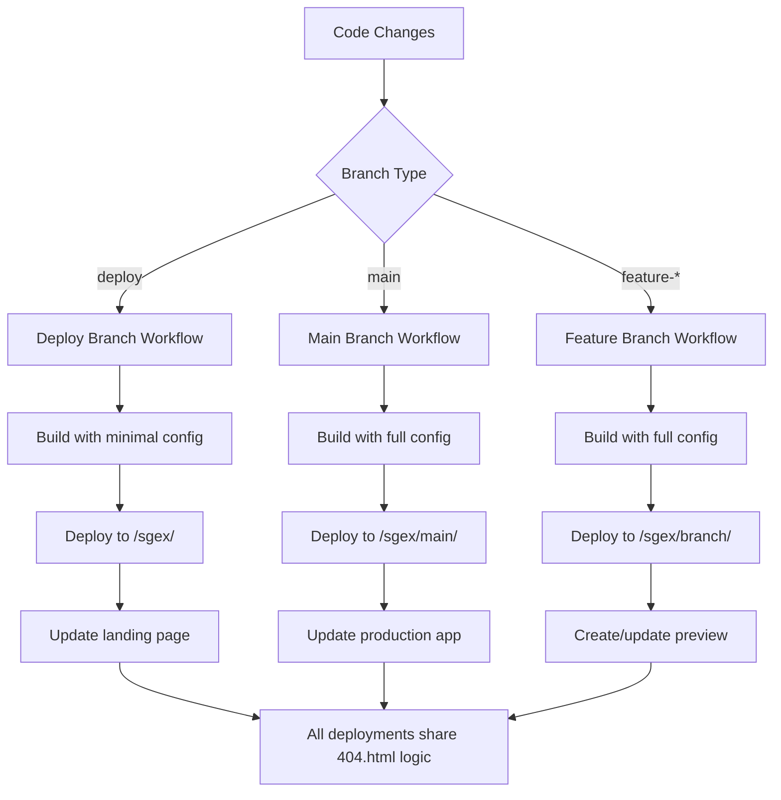

### Dependency Management:
1. **Shared 404.html**: Must handle all deployment patterns
2. **Configuration Sync**: Route configs must stay synchronized
3. **Asset Versioning**: Each deployment has independent asset versions
4. **Fallback Strategy**: Feature branches fall back to main when not deployed

## Key Insights and Implications

### Strengths of Current Architecture:
1. **Unified Routing**: Single 404.html handles all scenarios
2. **Independent Deployments**: Each branch deployment is isolated
3. **Graceful Fallbacks**: Missing feature branches fall back to main
4. **Flexible Configuration**: Deploy vs. full configurations for different needs

### Challenges and Complexities:
1. **404.html Complexity**: Single file handles all deployment logic (600+ lines)
2. **Configuration Sync**: Must keep multiple config files synchronized
3. **URL Pattern Complexity**: Multiple URL patterns to support all scenarios
4. **Debug Difficulty**: Complex routing logic makes debugging challenging

### Maintenance Considerations:
1. **Testing Requirements**: All deployment scenarios must be tested
2. **Documentation Needs**: Complex logic requires comprehensive documentation
3. **Change Impact**: Routing changes affect all deployment types
4. **Performance Impact**: Complex 404.html logic runs on every unmatched URL

This analysis reveals both the sophistication and complexity of the SGEX deployment architecture, showing how a single routing system supports multiple deployment scenarios while maintaining functionality and user experience across all contexts.