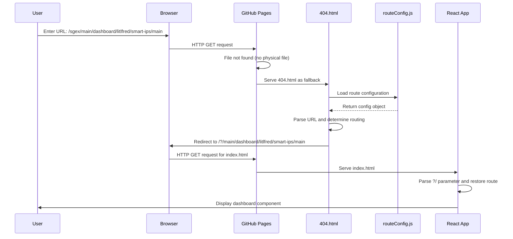
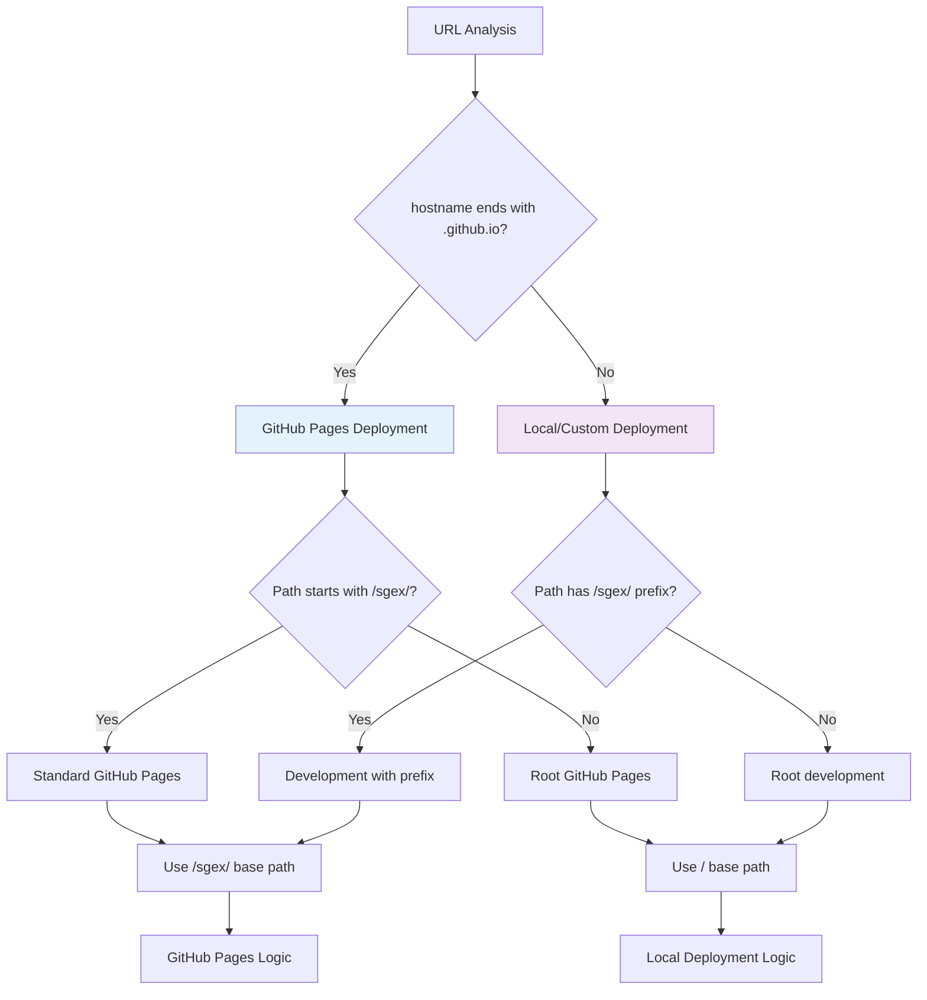
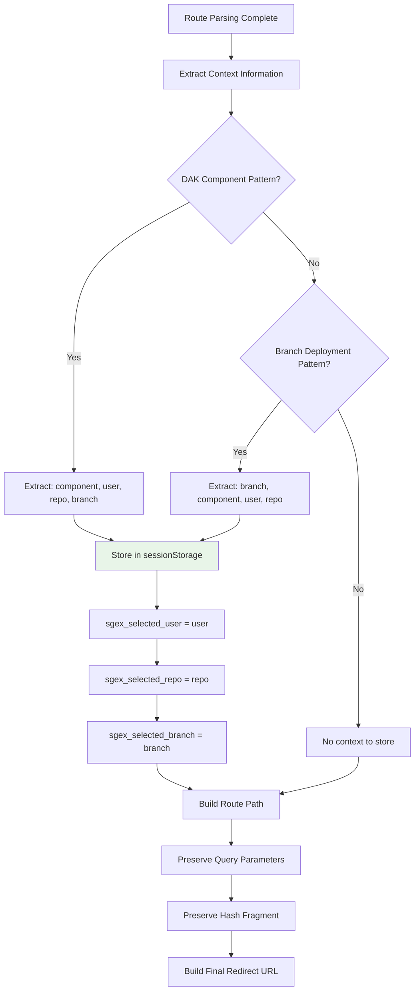
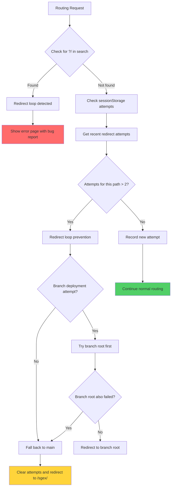
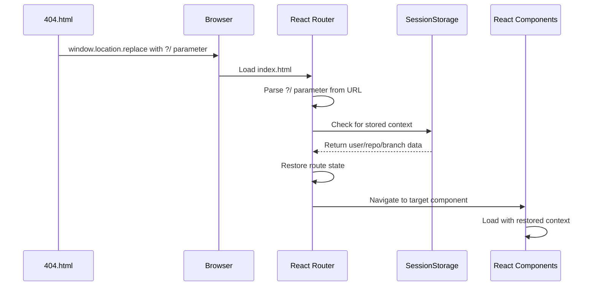
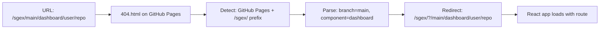
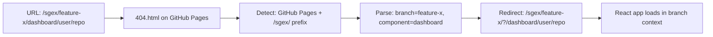
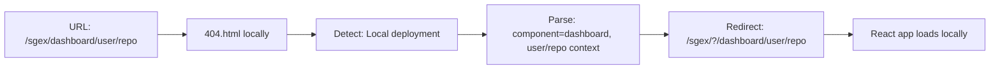

# SGEX Routing Logic Workflow Diagram

## Overview
This document provides detailed diagrams and explanations of the SGEX routing logic workflow, showing how URLs are processed and routed through the system.

## Main Routing Logic Flow

```mermaid
flowchart TD
    A[User enters URL] --> B{404.html triggered?}
    B -->|No| C[index.html loads normally]
    B -->|Yes| D[404.html routing logic]
    
    D --> E{Check for redirect loop}
    E -->|Found loop| F[Show error page]
    E -->|No loop| G[Record redirect attempt]
    
    G --> H{Determine deployment type}
    H -->|GitHub Pages| I[GitHub Pages Logic]
    H -->|Local/Other| J[Local Deployment Logic]
    
    I --> K{Path starts with /sgex/?}
    K -->|No| L[Show invalid path error]
    K -->|Yes| M[Parse URL segments]
    
    J --> N[Parse URL segments]
    
    M --> O[Route Analysis]
    N --> O
    
    O --> P{URL Pattern Type}
    P -->|/sgex/| Q[Root redirect]
    P -->|/sgex/docs/| R[Documentation route]
    P -->|/sgex/{branch}/| S[Branch deployment]
    P -->|/sgex/{component}/{user}/{repo}/| T[DAK component route]
    P -->|Unknown| U[Error page]
    
    Q --> V[redirectToSPA with empty route]
    R --> W[handleDocumentationRoute]
    S --> X[Branch context routing]
    T --> Y[handleDAKComponentRoute]
    
    V --> Z[Build final URL with ?/ prefix]
    W --> Z
    X --> Z
    Y --> Z
    
    Z --> AA[Store context in sessionStorage]
    AA --> BB[window.location.replace to SPA]
    BB --> CC[React app takes over]
    
    style F fill:#ff6b6b
    style L fill:#ff6b6b
    style U fill:#ff6b6b
    style CC fill:#51cf66
```

## Detailed Component Flow Analysis

### 1. Initial URL Processing



### 2. Deployment Type Detection



### 3. URL Pattern Recognition

```mermaid
flowchart TD
    A[URL Segments Array] --> B{segments.length}
    
    B -->|0-1| C[Root Path]
    B -->|2| D{Second segment type}
    B -->|3+| E{Pattern Analysis}
    
    D -->|"docs"| F[Documentation Route]
    D -->|Other| G[Branch Root]
    
    E --> H{Is DAK Component Pattern?}
    H -->|Yes| I[DAK Component Route]
    H -->|No| J{Is Branch + Component?}
    
    J -->|Yes| K[Branch Deployment Route]
    J -->|No| L[Unknown Pattern Error]
    
    C --> M[redirectToSPA('/', '')]
    F --> N[handleDocumentationRoute]
    G --> O[redirectToSPA with branch path]
    I --> P[handleDAKComponentRoute]
    K --> Q[Branch + Component routing]
    L --> R[showErrorPage]
    
    style R fill:#ff6b6b
    style M fill:#51cf66
    style N fill:#51cf66
    style O fill:#51cf66
    style P fill:#51cf66
    style Q fill:#51cf66
```

### 4. Context Storage and Preservation



## Route Configuration System

```mermaid
flowchart TD
    A[routeConfig.js loaded] --> B[Detect Deployment Type]
    
    B --> C{Deployment Type}
    C -->|Deploy Branch| D[Load routes-config.deploy.json]
    C -->|Main/Feature| E[Load routes-config.json]
    
    D --> F[Minimal Component Set]
    E --> G[Full Component Set]
    
    F --> H[Landing page functionality only]
    G --> I[Full DAK editing capabilities]
    
    H --> J[Available for 404.html routing]
    I --> J
    
    J --> K[isValidDAKComponent() function]
    K --> L[standardComponents object]
    L --> M[Route validation in 404.html]
    
    style F fill:#fff3cd
    style G fill:#d4edda
```

## Error Handling and Loop Prevention



## React App Integration



## Deployment-Specific Behavior

### GitHub Pages Main Deployment


### GitHub Pages Feature Branch


### Local Development


## Key Benefits of Current Approach

1. **Unified Handling**: Single 404.html handles all deployment scenarios
2. **Context Preservation**: User/repo/branch information extracted and stored
3. **Loop Prevention**: Sophisticated cycle detection prevents infinite redirects
4. **Dynamic Configuration**: Route validation uses loaded configuration, not hardcoded lists
5. **Graceful Fallbacks**: Multiple fallback strategies for failed routes
6. **Query/Hash Preservation**: URL parameters and fragments maintained through redirects

## Identified Issues

1. **Complexity**: The 404.html file is very complex (600+ lines)
2. **Performance**: Synchronous XHR loading of route configuration
3. **Maintenance**: Complex logic requires careful testing for each change
4. **Error Recovery**: While sophisticated, error recovery could be simpler
5. **Documentation**: The logic flow could benefit from better inline documentation

This workflow demonstrates both the sophistication and complexity of the current routing solution, highlighting areas for potential simplification while maintaining functionality.