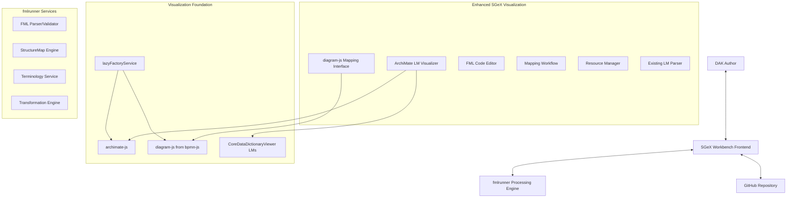

# FML/StructureMap Integration Plan for SGEX Workbench

## Overview

This document outlines the comprehensive architecture and implementation plan for integrating FHIR Mapping Language (FML) and StructureMap authoring, visualization, and execution capabilities into the SGEX Workbench, leveraging fmlrunner as the upstream processing engine.

## Executive Summary

The FML/StructureMap integration adds a powerful new DAK component that enables visual mapping between FHIR Logical Models, advanced FML authoring with syntax highlighting and validation, and real-time transformation execution. This enhancement aligns with the WHO SMART Guidelines L2/L3 architecture, where L2 represents mapping logic patterns and L3 provides FHIR-specific transformation implementations.

## Architectural Alignment

### SGeX Workbench Responsibilities (Frontend)
- **ArchiMate Logical Model Visualization**: Interactive ArchiMate-based visualization of FHIR Logical Models using archimate-js
- **diagram-js Mapping Interface**: Interactive mapping connections and overlays using existing bpmn-js/diagram-js infrastructure
- **FML Code Editor**: Monaco Editor-based .fml syntax highlighting with live validation feedback
- **Mapping Workflows**: Guided mapping creation and editing workflows with ArchiMate context
- **Resource Management**: Storage and versioning of StructureMaps in GitHub repositories

### fmlrunner Responsibilities (Processing Engine)
- **FML Processing**: Parsing, validation, and execution of FML expressions
- **StructureMap Operations**: Complete StructureMap lifecycle management
- **Transformation Engine**: Resource transformation and bundle processing
- **Terminology Services**: Concept mapping and terminology validation

### Enhanced Visualization Strategy
- **Strategic View**: ArchiMate Application Layer models showing logical model relationships and business context
- **Technical View**: diagram-js based detailed mapping interface for precise FML expression authoring
- **Reuse Existing LMs**: Generate visualizations from existing Logical Models already parsed in CoreDataDictionaryViewer

## Integration Architecture



## Implementation Plan

### Phase 1: Foundation Components (Sprint 1-2)

#### 1.1 Enhanced Service Integration Layer

**File: `src/services/fmlRunnerService.js`** (No changes - remains as specified)

**File: `src/services/archimateModelService.js` (NEW)**

```javascript
class ArchimateModelService {
  constructor() {
    this.logger = logger.getLogger('ArchimateModelService');
  }

  // Convert existing FSH Logical Models to ArchiMate Application Objects
  generateArchimateFromLogicalModels(logicalModels) {
    return logicalModels.map(lm => ({
      id: lm.id,
      name: lm.name,
      type: 'application-data-object',
      documentation: lm.definition || `Logical Model: ${lm.name}`,
      elements: lm.elements.map(elem => ({
        id: `${lm.id}.${elem.path}`,
        name: elem.path,
        type: 'application-data-object',
        cardinality: elem.cardinality,
        dataType: elem.type,
        parent: lm.id
      })),
      relationships: this.generateElementRelationships(lm.elements, lm.id)
    }));
  }

  // Generate ArchiMate relationships between elements
  generateElementRelationships(elements, modelId) {
    const relationships = [];
    elements.forEach(element => {
      // Create composition relationships for nested elements
      if (element.path.includes('.')) {
        const parentPath = element.path.substring(0, element.path.lastIndexOf('.'));
        const parentElement = elements.find(e => e.path === parentPath);
        if (parentElement) {
          relationships.push({
            id: `${modelId}.${parentPath}-${element.path}`,
            type: 'composition',
            source: `${modelId}.${parentPath}`,
            target: `${modelId}.${element.path}`
          });
        }
      }
    });
    return relationships;
  }
}
```

**Extended File: `src/services/lazyFactoryService.js`**

```javascript
// Add archimate-js factory support
export async function createLazyArchimateViewer(options = {}) {
  const ArchimateViewer = await lazyLoadArchimateViewer();
  return new ArchimateViewer(options);
}

export async function createLazyDiagramJsRenderer(options = {}) {
  const DiagramRenderer = await lazyLoadDiagramJsRenderer();
  return new DiagramRenderer(options);
}
```

**Extended File: `src/services/libraryLoaderService.js`**

```javascript
// Add archimate-js lazy loading
export async function lazyLoadArchimateViewer() {
  const cacheKey = 'archimate-viewer';
  
  if (moduleCache.has(cacheKey)) {
    return moduleCache.get(cacheKey);
  }
  
  const ArchimateViewer = await import('archimate-js/lib/Viewer');
  const viewer = ArchimateViewer.default;
  moduleCache.set(cacheKey, viewer);
  return viewer;
}

// Add diagram-js direct access (extracted from bpmn-js)
export async function lazyLoadDiagramJsRenderer() {
  const cacheKey = 'diagram-js-renderer';
  
  if (moduleCache.has(cacheKey)) {
    return moduleCache.get(cacheKey);
  }
  
  const DiagramJS = await import('diagram-js');
  const renderer = DiagramJS.default;
  moduleCache.set(cacheKey, renderer);
  return renderer;
}
```

**Required fmlrunner API Endpoints:**
- `POST /fml/validate` - FML syntax validation with error reporting
- `POST /fml/parse` - Parse FML to StructureMap JSON
- `POST /structuremap/transform` - Execute transformation with source resource/bundle
- `GET /fml/suggestions` - Code completion and syntax suggestions
- `POST /terminology/translate` - Concept mapping and translation
- `GET /terminology/validate` - Terminology validation

#### 1.2 Enhanced Logical Model Service
**File: `src/services/logicalModelService.js`**

```javascript
import githubService from './githubService';
import archimateModelService from './archimateModelService';

class LogicalModelService {
  // Reuse existing LM parsing from CoreDataDictionaryViewer
  async getLogicalModelsFromExistingParser(owner, repo, branch) {
    // Leverage the FSH parsing logic already implemented
    return this.getLogicalModelsFromFSH(owner, repo, branch);
  }
  
  // Enhanced to generate both traditional nodes and ArchiMate models
  generateVisualizationData(logicalModels, mappings, viewType = 'archimate') {
    if (viewType === 'archimate') {
      return this.generateArchimateVisualization(logicalModels, mappings);
    } else {
      return this.generateDiagramJsVisualization(logicalModels, mappings);
    }
  }

  generateArchimateVisualization(logicalModels, mappings) {
    // Convert logical models to ArchiMate Application Layer objects
    const archimateModels = archimateModelService.generateArchimateFromLogicalModels(logicalModels);
    
    return {
      type: 'archimate',
      models: archimateModels,
      mappings: mappings.map(mapping => ({
        id: mapping.id,
        source: mapping.sourceModel,
        target: mapping.targetModel,
        type: 'flow-relationship',
        documentation: mapping.fmlExpression
      }))
    };
  }

  generateDiagramJsVisualization(logicalModels, mappings) {
    // Traditional node-based visualization using diagram-js
    return {
      type: 'diagram-js',
      nodes: logicalModels.map((model, index) => ({
        id: model.id,
        name: model.name,
        type: model.type,
        elements: model.elements,
        position: { x: index * 400, y: 100 },
        width: 300,
        height: Math.max(200, model.elements.length * 25 + 50)
      })),
      edges: mappings.map(mapping => ({
        id: mapping.id,
        source: mapping.sourceElement,
        target: mapping.targetElement,
        label: mapping.fmlExpression,
        isValid: mapping.isValid
      }))
    };
  }
}
```
  
#### 1.3 ArchiMate-Enhanced React Components

**ArchiMate Logical Model Viewer: `src/components/ArchimateLogicalModelViewer.js`**
- ArchiMate-based visualization using archimate-js library
- Application Layer view of FHIR Logical Models
- Interactive exploration of model relationships
- Seamless integration with existing SGEX page framework

**diagram-js Mapping Interface: `src/components/DiagramJsMappingInterface.js`**
- Reuses existing bpmn-js/diagram-js infrastructure
- Custom overlays for FML expression visualization
- Interactive mapping creation with drag-and-drop
- Leverages SGEX's established diagram rendering patterns

**Enhanced FML Code Editor: `src/components/FMLCodeEditor.js`**
- Monaco Editor integration with FML syntax highlighting (unchanged)
- Real-time validation with fmlrunner integration
- ArchiMate context awareness for code completion
- Split-pane view with both ArchiMate and diagram-js views

### Phase 2: Enhanced Mapping Workflow (Sprint 3-4)

#### 2.1 Dual-View Mapping Workflow Component
**File: `src/components/StructureMapWorkflow.js`**

```javascript
const StructureMapWorkflow = () => {
  const { profile, repository, branch } = usePage();
  
  // Enhanced workflow with dual visualization modes
  const [workflowStep, setWorkflowStep] = useState('source-selection');
  const [visualizationMode, setVisualizationMode] = useState('archimate'); // 'archimate' | 'diagram-js'
  const [sourceModel, setSourceModel] = useState(null);
  const [targetModel, setTargetModel] = useState(null);
  const [mappings, setMappings] = useState([]);
  const [fmlContent, setFmlContent] = useState('');
  
  return (
    <AssetEditorLayout pageId="structure-map-workflow">
      <div className="workflow-header">
        <ViewToggle 
          mode={visualizationMode} 
          onModeChange={setVisualizationMode}
          options={[
            { value: 'archimate', label: 'Strategic View (ArchiMate)' },
            { value: 'diagram-js', label: 'Technical View (Detailed)' }
          ]}
        />
      </div>
      
      {workflowStep === 'source-selection' && <SourceModelSelection />}
      {workflowStep === 'target-selection' && <TargetModelSelection />}
      {workflowStep === 'mapping-creation' && (
        <div className="dual-view-mapping-interface">
          {visualizationMode === 'archimate' ? (
            <ArchimateLogicalModelViewer 
              models={[sourceModel, targetModel]} 
              mappings={mappings} 
              onMappingCreate={handleArchimateMapping}
            />
          ) : (
            <DiagramJsMappingInterface 
              models={[sourceModel, targetModel]} 
              mappings={mappings}
              onMappingCreate={handleDetailedMapping}
            />
          )}
          <FMLCodeEditor content={fmlContent} onChange={setFmlContent} />
        </div>
      )}
      {workflowStep === 'testing' && <MappingTester />}
    </AssetEditorLayout>
  );
};
```

#### 2.2 Enhanced Mapping Visualization Components

**ArchiMate Strategic View: `src/components/ArchimateLogicalModelViewer.js`**
- High-level business context visualization
- ArchiMate Application Layer relationships
- Focus on logical model interactions and dependencies
- Business-friendly representation for stakeholder communication

**diagram-js Technical View: `src/components/DiagramJsMappingInterface.js`**
- Detailed element-level mapping visualization
- Precise FML expression editing and validation
- Fine-grained drag-and-drop mapping creation
- Technical implementation details and constraints

**Enhanced Element Property Panel: `src/components/ElementPropertyPanel.js`**
- Context-aware property display (ArchiMate vs. technical)
- FML expression editing for selected mappings
- ArchiMate documentation integration
- Cardinality and constraint visualization

### Phase 3: Advanced Features (Sprint 5-6)

#### 3.1 Advanced Mapping Features

**Complex Mapping Support:**
- Group/nested element mappings with visual indentation
- Conditional logic visualization with branching paths
- Function call representations with parameter flows

**Mapping Templates:**
- Pre-built mapping patterns for common transformations
- Template library with WHO SMART Guidelines patterns
- Custom template creation and sharing

#### 3.2 Testing and Validation Framework

**Mapping Test Runner: `src/components/MappingTestRunner.js`**
- Test case management with sample source resources
- Expected outcome validation against target resources
- Batch testing with multiple scenarios
- Performance metrics and transformation logs

**Terminology Validation:**
- Real-time concept validation during mapping creation
- ConceptMap integration for terminology transformations
- ValueSet validation for coded elements

### Phase 4: Integration and Polish (Sprint 7-8)

#### 4.1 DAK Component Integration

**Router Integration:**
Following SGEX patterns, add routes to `src/services/componentRouteService.js`:

```javascript
// StructureMap routes
case 'StructureMapWorkflow':
  LazyComponent = React.lazy(() => import('../components/StructureMapWorkflow'));
  break;
case 'LogicalModelVisualizer':
  LazyComponent = React.lazy(() => import('../components/LogicalModelVisualizer'));
  break;
case 'FMLCodeEditor':
  LazyComponent = React.lazy(() => import('../components/FMLCodeEditor'));
  break;
```

**DAK Dashboard Integration:**
Add StructureMap/FML component card to the main DAK dashboard following existing patterns.

#### 4.2 Help System Integration

**Contextual Help Topics in `src/services/helpContentService.js`:**

```javascript
'structure-map-workflow': [
  {
    id: 'fml-introduction',
    title: 'Introduction to FHIR Mapping Language',
    badge: '/sgex/cat-paw-icon.svg',
    type: 'slideshow',
    content: [
      {
        title: 'What is FML?',
        content: '<p>FHIR Mapping Language (FML) enables transformation...</p>'
      }
    ]
  },
  {
    id: 'mapping-workflow',
    title: 'Creating Your First StructureMap',
    badge: '/sgex/cat-paw-icon.svg',
    type: 'slideshow',
    content: [
      {
        title: 'Step 1: Select Source Model',
        content: '<p>Choose the FHIR logical model to map from...</p>'
      }
    ]
  }
],
```

### Phase 5: Advanced Visualization (Sprint 9-10)

#### 5.1 Advanced ArchiMate and diagram-js Integration

**Multi-Layer Visualization:**
- ArchiMate Application Layer for business context
- diagram-js technical layer for implementation details
- Seamless navigation between strategic and tactical views
- Synchronized model state across visualization modes

**Enhanced Interactive Canvas:**
- ArchiMate-native minimap for strategic navigation
- diagram-js precision tools for detailed mapping
- Layer management for complex transformation scenarios
- Visual debugging with step-through transformation using both views

**Export and Documentation:**
- ArchiMate model export for enterprise architecture tools
- diagram-js SVG export for technical documentation
- Dual-format mapping documentation (business + technical)
- ArchiMate-enhanced impact analysis and dependency graphs

#### 5.2 Collaboration Features

**Multi-author Mapping:**
- Conflict resolution for concurrent mapping editing
- Mapping review and approval workflows
- Change tracking with visual diff representation

## Technical Specifications

### Component Architecture

**Base Component Pattern:**
All FML/StructureMap components follow the established SGEX patterns:

```javascript
const StructureMapComponent = () => {
  return (
    <PageLayout pageName="structure-map-component">
      <StructureMapComponentContent />
    </PageLayout>
  );
};

const StructureMapComponentContent = () => {
  const { profile, repository, branch } = useDAKParams();
  // Component implementation
};
```

### Styling Guidelines

**CSS Classes:**
Following SGEX naming conventions:
- `.structure-map-*` for StructureMap-specific components
- `.fml-editor-*` for FML editor components  
- `.logical-model-*` for model visualization components
- `.mapping-*` for mapping-specific UI elements

**Color Scheme:**
- Primary: WHO blue (#0078d4) for main interface elements
- Secondary: Light blue (#e3f2fd) for backgrounds
- Accent: Green (#28a745) for successful validations
- Error: Red (#dc3545) for validation errors
- Warning: Orange (#ffc107) for warnings

### Data Models

**StructureMap Data Model:**
```typescript
interface StructureMapData {
  id: string;
  name: string;
  fmlContent: string;
  sourceModels: LogicalModel[];
  targetModels: LogicalModel[];
  mappings: Mapping[];
  validationStatus: ValidationStatus;
  lastModified: Date;
  author: string;
}

interface Mapping {
  id: string;
  sourceElement: string;
  targetElement: string;
  fmlExpression: string;
  isValid: boolean;
  complexity: 'simple' | 'complex' | 'conditional';
}
```

### Performance Considerations

**Lazy Loading:**
- Monaco Editor lazy loading via `lazyFactoryService`
- SVG visualization components loaded on demand
- Large StructureDefinition processing with web workers

**Caching Strategy:**
- Parsed logical models cached in `repositoryCacheService`
- FML validation results cached for performance
- SVG visualization data cached for re-rendering

### Error Handling

**Graceful Degradation:**
- Fallback to text-only FML editing if visualization fails
- Mock data for offline development and testing
- Clear error messages with recovery suggestions

**Validation Integration:**
- Real-time FML syntax validation with error highlighting
- StructureMap semantic validation via fmlrunner
- Terminology validation with clear error messages

## Required fmlrunner API Specification

### Core Endpoints

#### FML Processing
```
POST /api/v1/fml/validate
Content-Type: application/json
{
  "fml": "string",
  "context": {
    "sourceProfiles": ["url1", "url2"],
    "targetProfiles": ["url1", "url2"]
  }
}

Response:
{
  "isValid": boolean,
  "errors": [
    {
      "line": number,
      "column": number,
      "message": "string",
      "severity": "error|warning|info"
    }
  ],
  "suggestions": [
    {
      "range": { "start": position, "end": position },
      "text": "string",
      "description": "string"
    }
  ]
}
```

#### StructureMap Operations
```
POST /api/v1/structuremap/transform
Content-Type: application/json
{
  "structureMap": "fml content or resource",
  "source": "FHIR resource",
  "parameters": {}
}

Response:
{
  "success": boolean,
  "result": "transformed FHIR resource",
  "logs": [
    {
      "level": "info|warn|error",
      "message": "string",
      "location": "optional FML line reference"
    }
  ]
}
```

#### Code Completion
```
POST /api/v1/fml/complete
Content-Type: application/json
{
  "fml": "string",
  "position": { "line": number, "column": number },
  "context": {
    "sourceProfiles": ["url1"],
    "targetProfiles": ["url1"]
  }
}

Response:
{
  "suggestions": [
    {
      "label": "string",
      "insertText": "string",
      "documentation": "string",
      "kind": "function|element|keyword"
    }
  ]
}
```

#### Terminology Services
```
POST /api/v1/terminology/translate
Content-Type: application/json
{
  "conceptMap": "ConceptMap resource",
  "system": "string",
  "code": "string"
}

Response:
{
  "result": [
    {
      "system": "string",
      "code": "string", 
      "display": "string",
      "equivalence": "equal|equivalent|wider|subsumes|narrower|specializes|inexact|unmatched|disjoint"
    }
  ]
}
```

### Configuration Requirements

**Enhanced Dependencies (package.json additions):**
```json
{
  "dependencies": {
    "archimate-js": "^1.0.0",
    "diagram-js": "^12.0.0",
    "bpmn-js": "^18.6.2",
    "monaco-editor": "^0.45.0"
  }
}
```

**Environment Variables:**
```
REACT_APP_FMLRUNNER_URL=http://localhost:8080
REACT_APP_FMLRUNNER_TIMEOUT=30000
REACT_APP_ENABLE_FML_CACHING=true
REACT_APP_ENABLE_ARCHIMATE_VISUALIZATION=true
REACT_APP_DEFAULT_VISUALIZATION_MODE=archimate
```

**Lazy Loading Configuration:**
The enhanced approach leverages SGEX's existing lazy loading infrastructure:
- `archimate-js` loaded on-demand for ArchiMate visualization
- `diagram-js` extracted from existing `bpmn-js` dependency 
- Existing Logical Model parsing from `CoreDataDictionaryViewer`
- Monaco Editor patterns already established in SGEX

**CORS Configuration:**
fmlrunner must allow CORS requests from SGEX domains:
- `https://litlfred.github.io`
- `http://localhost:3000` (development)

## Testing Strategy

### Unit Testing
- Service layer testing with mocked fmlrunner responses
- Component testing with React Testing Library
- FML validation logic testing with sample FML files

### Integration Testing  
- End-to-end mapping creation workflow
- fmlrunner API integration testing
- GitHub repository operations testing

### User Acceptance Testing
- Mapping workflow usability testing
- Performance testing with large StructureDefinitions
- Cross-browser compatibility testing

## Success Metrics

### Technical Metrics
- FML validation response time < 500ms
- Visualization rendering time < 2 seconds for typical models
- Error-free integration with existing SGEX workflows

### User Experience Metrics
- Time to create first mapping < 10 minutes for new users
- Mapping accuracy improved through visual feedback
- Reduced FML syntax errors through real-time validation

## Deployment Considerations

### Development Environment
- Local fmlrunner instance for development
- Mock fmlrunner service for testing without backend
- Docker compose setup for integrated development

### Production Environment
- fmlrunner service deployment strategy
- CORS and security configuration
- Performance monitoring and alerting

## Future Enhancements

### Advanced Features
- Mapping library and template sharing
- Version control for StructureMaps with visual diff
- Integration with FHIR Validator for additional validation
- Export to other mapping formats (XSLT, JSONPath)

### AI-Powered Features
- AI-assisted mapping suggestions based on element semantics
- Automated mapping generation from examples
- Natural language mapping description generation

## Key Architectural Enhancements

### Enhanced Visualization Strategy

**1. Dual-View Architecture:**
- **Strategic View**: ArchiMate Application Layer models for business stakeholder communication
- **Technical View**: diagram-js detailed interface for precise FML implementation
- **Seamless Navigation**: Toggle between views with synchronized state

**2. Existing Infrastructure Reuse:**
- **Logical Models**: Reuse existing FSH parsing from `CoreDataDictionaryViewer`
- **diagram-js Foundation**: Leverage existing `bpmn-js` infrastructure and patterns
- **Lazy Loading**: Extend established `lazyFactoryService` for `archimate-js`
- **Component Patterns**: Follow existing SGEX PageLayout and AssetEditorLayout patterns

**3. Enhanced Service Layer:**
- **ArchimateModelService**: Convert FSH Logical Models to ArchiMate Application Objects
- **Enhanced LogicalModelService**: Support both ArchiMate and diagram-js visualization modes
- **Backward Compatibility**: Maintain existing APIs while adding enhanced visualization

### Implementation Benefits

**Stakeholder Value:**
- Business users get ArchiMate strategic views for logical model relationships
- Technical users get detailed diagram-js interfaces for precise FML authoring
- Existing DAK Logical Models automatically available for visualization

**Technical Advantages:**
- Minimal new dependencies (`archimate-js` only major addition)
- Maximum reuse of existing SGEX infrastructure
- Proven lazy loading and component patterns
- Enhanced visualization without breaking existing functionality

---

*This plan ensures the FML/StructureMap integration follows SGEX architectural patterns while providing comprehensive mapping capabilities for WHO SMART Guidelines DAK authoring.*