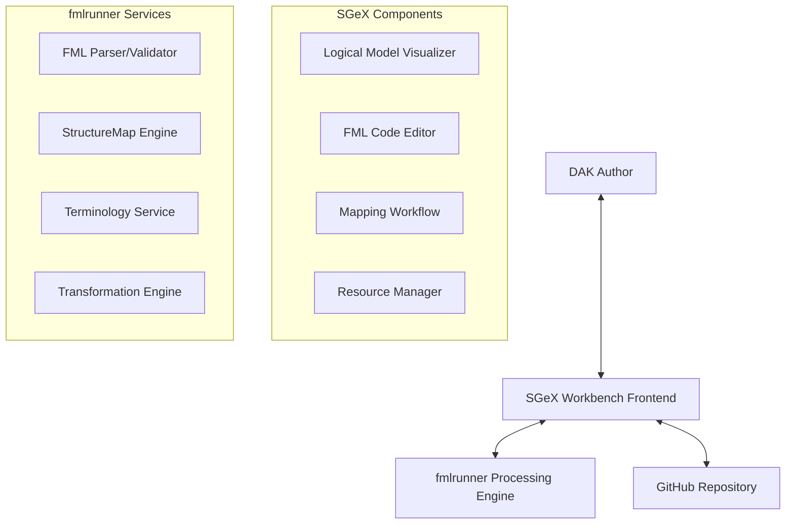

# FML/StructureMap Integration Plan for SGEX Workbench

## Overview

This document outlines the comprehensive architecture and implementation plan for integrating FHIR Mapping Language (FML) and StructureMap authoring, visualization, and execution capabilities into the SGEX Workbench, leveraging fmlrunner as the upstream processing engine.

## Executive Summary

The FML/StructureMap integration adds a powerful new DAK component that enables visual mapping between FHIR Logical Models, advanced FML authoring with syntax highlighting and validation, and real-time transformation execution. This enhancement aligns with the WHO SMART Guidelines L2/L3 architecture, where L2 represents mapping logic patterns and L3 provides FHIR-specific transformation implementations.

## Architectural Alignment

### SGeX Workbench Responsibilities (Frontend)
- **Visual Mapping Interface**: Interactive SVG-based visualization of logical models as nodes and mappings as annotated edges
- **FML Code Editor**: Monaco Editor-based .fml syntax highlighting with live validation feedback
- **Mapping Workflows**: Guided mapping creation and editing workflows
- **Resource Management**: Storage and versioning of StructureMaps in GitHub repositories

### fmlrunner Responsibilities (Processing Engine)
- **FML Processing**: Parsing, validation, and execution of FML expressions
- **StructureMap Operations**: Complete StructureMap lifecycle management
- **Transformation Engine**: Resource transformation and bundle processing
- **Terminology Services**: Concept mapping and terminology validation

## Integration Architecture



## Implementation Plan

### Phase 1: Foundation Components (Sprint 1-2)

#### 1.1 Service Integration Layer
**File: `src/services/fmlRunnerService.js`**

```javascript
class FMLRunnerService {
  constructor() {
    this.baseUrl = process.env.REACT_APP_FMLRUNNER_URL || 'http://localhost:8080';
    this.logger = logger.getLogger('FMLRunnerService');
  }

  // StructureMap Operations
  async validateStructureMap(fmlContent) { }
  async transformResource(structureMap, sourceResource) { }
  async parseStructureMap(fmlContent) { }
  
  // FML Validation and Suggestions
  async validateFML(fmlContent) { }
  async getFMLSuggestions(fmlContent, position) { }
  
  // Terminology Operations
  async translateConcept(conceptMap, sourceSystem, code) { }
  async validateTerminology(valueSet, concept) { }
}
```

**Required fmlrunner API Endpoints:**
- `POST /fml/validate` - FML syntax validation with error reporting
- `POST /fml/parse` - Parse FML to StructureMap JSON
- `POST /structuremap/transform` - Execute transformation with source resource/bundle
- `GET /fml/suggestions` - Code completion and syntax suggestions
- `POST /terminology/translate` - Concept mapping and translation
- `GET /terminology/validate` - Terminology validation

#### 1.2 Logical Model Service
**File: `src/services/logicalModelService.js`**

```javascript
class LogicalModelService {
  // Extract logical models from FHIR StructureDefinitions
  async getLogicalModels(owner, repo, branch) { }
  
  // Parse StructureDefinition to visual model nodes
  parseStructureDefinitionToNodes(structureDefinition) { }
  
  // Generate SVG visualization data
  generateVisualizationData(logicalModels, mappings) { }
}
```

#### 1.3 Core React Components

**Logical Model Visualizer: `src/components/LogicalModelVisualizer.js`**
- Interactive SVG rendering of FHIR StructureDefinitions as node graphs
- Click/hover interactions for element details
- Drag-and-drop interface for creating mappings
- Zoom and pan capabilities for large models

**FML Code Editor: `src/components/FMLCodeEditor.js`**
- Monaco Editor integration with FML syntax highlighting
- Real-time validation with fmlrunner integration
- Code completion and error reporting
- Split-pane view with visual mapping interface

### Phase 2: Mapping Workflow (Sprint 3-4)

#### 2.1 Mapping Workflow Component
**File: `src/components/StructureMapWorkflow.js`**

```javascript
const StructureMapWorkflow = () => {
  const { profile, repository, branch } = usePage();
  
  // Workflow states: source-selection, target-selection, mapping-creation, testing
  const [workflowStep, setWorkflowStep] = useState('source-selection');
  const [sourceModel, setSourceModel] = useState(null);
  const [targetModel, setTargetModel] = useState(null);
  const [mappings, setMappings] = useState([]);
  const [fmlContent, setFmlContent] = useState('');
  
  return (
    <AssetEditorLayout pageId="structure-map-workflow">
      {workflowStep === 'source-selection' && <SourceModelSelection />}
      {workflowStep === 'target-selection' && <TargetModelSelection />}
      {workflowStep === 'mapping-creation' && (
        <div className="mapping-interface">
          <LogicalModelVisualizer models={[sourceModel, targetModel]} mappings={mappings} />
          <FMLCodeEditor content={fmlContent} onChange={setFmlContent} />
        </div>
      )}
      {workflowStep === 'testing' && <MappingTester />}
    </AssetEditorLayout>
  );
};
```

#### 2.2 Mapping Visualization Components

**Mapping Edge Renderer: `src/components/MappingEdgeRenderer.js`**
- SVG path rendering between source and target elements
- Interactive edge editing with FML expression preview
- Visual indicators for mapping complexity and validation status

**Element Property Panel: `src/components/ElementPropertyPanel.js`**
- Side panel showing detailed element information
- FML expression editing for selected mappings
- Cardinality and constraint visualization

### Phase 3: Advanced Features (Sprint 5-6)

#### 3.1 Advanced Mapping Features

**Complex Mapping Support:**
- Group/nested element mappings with visual indentation
- Conditional logic visualization with branching paths
- Function call representations with parameter flows

**Mapping Templates:**
- Pre-built mapping patterns for common transformations
- Template library with WHO SMART Guidelines patterns
- Custom template creation and sharing

#### 3.2 Testing and Validation Framework

**Mapping Test Runner: `src/components/MappingTestRunner.js`**
- Test case management with sample source resources
- Expected outcome validation against target resources
- Batch testing with multiple scenarios
- Performance metrics and transformation logs

**Terminology Validation:**
- Real-time concept validation during mapping creation
- ConceptMap integration for terminology transformations
- ValueSet validation for coded elements

### Phase 4: Integration and Polish (Sprint 7-8)

#### 4.1 DAK Component Integration

**Router Integration:**
Following SGEX patterns, add routes to `src/services/componentRouteService.js`:

```javascript
// StructureMap routes
case 'StructureMapWorkflow':
  LazyComponent = React.lazy(() => import('../components/StructureMapWorkflow'));
  break;
case 'LogicalModelVisualizer':
  LazyComponent = React.lazy(() => import('../components/LogicalModelVisualizer'));
  break;
case 'FMLCodeEditor':
  LazyComponent = React.lazy(() => import('../components/FMLCodeEditor'));
  break;
```

**DAK Dashboard Integration:**
Add StructureMap/FML component card to the main DAK dashboard following existing patterns.

#### 4.2 Help System Integration

**Contextual Help Topics in `src/services/helpContentService.js`:**

```javascript
'structure-map-workflow': [
  {
    id: 'fml-introduction',
    title: 'Introduction to FHIR Mapping Language',
    badge: '/sgex/cat-paw-icon.svg',
    type: 'slideshow',
    content: [
      {
        title: 'What is FML?',
        content: '<p>FHIR Mapping Language (FML) enables transformation...</p>'
      }
    ]
  },
  {
    id: 'mapping-workflow',
    title: 'Creating Your First StructureMap',
    badge: '/sgex/cat-paw-icon.svg',
    type: 'slideshow',
    content: [
      {
        title: 'Step 1: Select Source Model',
        content: '<p>Choose the FHIR logical model to map from...</p>'
      }
    ]
  }
],
```

### Phase 5: Advanced Visualization (Sprint 9-10)

#### 5.1 Enhanced Visual Features

**Interactive Mapping Canvas:**
- Minimap for navigation in large mapping scenarios
- Layer management for complex transformations
- Visual debugging with step-through transformation

**Export and Documentation:**
- SVG export of mapping visualizations
- Auto-generated mapping documentation
- Mapping impact analysis and dependency graphs

#### 5.2 Collaboration Features

**Multi-author Mapping:**
- Conflict resolution for concurrent mapping editing
- Mapping review and approval workflows
- Change tracking with visual diff representation

## Technical Specifications

### Component Architecture

**Base Component Pattern:**
All FML/StructureMap components follow the established SGEX patterns:

```javascript
const StructureMapComponent = () => {
  return (
    <PageLayout pageName="structure-map-component">
      <StructureMapComponentContent />
    </PageLayout>
  );
};

const StructureMapComponentContent = () => {
  const { profile, repository, branch } = useDAKParams();
  // Component implementation
};
```

### Styling Guidelines

**CSS Classes:**
Following SGEX naming conventions:
- `.structure-map-*` for StructureMap-specific components
- `.fml-editor-*` for FML editor components  
- `.logical-model-*` for model visualization components
- `.mapping-*` for mapping-specific UI elements

**Color Scheme:**
- Primary: WHO blue (#0078d4) for main interface elements
- Secondary: Light blue (#e3f2fd) for backgrounds
- Accent: Green (#28a745) for successful validations
- Error: Red (#dc3545) for validation errors
- Warning: Orange (#ffc107) for warnings

### Data Models

**StructureMap Data Model:**
```typescript
interface StructureMapData {
  id: string;
  name: string;
  fmlContent: string;
  sourceModels: LogicalModel[];
  targetModels: LogicalModel[];
  mappings: Mapping[];
  validationStatus: ValidationStatus;
  lastModified: Date;
  author: string;
}

interface Mapping {
  id: string;
  sourceElement: string;
  targetElement: string;
  fmlExpression: string;
  isValid: boolean;
  complexity: 'simple' | 'complex' | 'conditional';
}
```

### Performance Considerations

**Lazy Loading:**
- Monaco Editor lazy loading via `lazyFactoryService`
- SVG visualization components loaded on demand
- Large StructureDefinition processing with web workers

**Caching Strategy:**
- Parsed logical models cached in `repositoryCacheService`
- FML validation results cached for performance
- SVG visualization data cached for re-rendering

### Error Handling

**Graceful Degradation:**
- Fallback to text-only FML editing if visualization fails
- Mock data for offline development and testing
- Clear error messages with recovery suggestions

**Validation Integration:**
- Real-time FML syntax validation with error highlighting
- StructureMap semantic validation via fmlrunner
- Terminology validation with clear error messages

## Required fmlrunner API Specification

### Core Endpoints

#### FML Processing
```
POST /api/v1/fml/validate
Content-Type: application/json
{
  "fml": "string",
  "context": {
    "sourceProfiles": ["url1", "url2"],
    "targetProfiles": ["url1", "url2"]
  }
}

Response:
{
  "isValid": boolean,
  "errors": [
    {
      "line": number,
      "column": number,
      "message": "string",
      "severity": "error|warning|info"
    }
  ],
  "suggestions": [
    {
      "range": { "start": position, "end": position },
      "text": "string",
      "description": "string"
    }
  ]
}
```

#### StructureMap Operations
```
POST /api/v1/structuremap/transform
Content-Type: application/json
{
  "structureMap": "fml content or resource",
  "source": "FHIR resource",
  "parameters": {}
}

Response:
{
  "success": boolean,
  "result": "transformed FHIR resource",
  "logs": [
    {
      "level": "info|warn|error",
      "message": "string",
      "location": "optional FML line reference"
    }
  ]
}
```

#### Code Completion
```
POST /api/v1/fml/complete
Content-Type: application/json
{
  "fml": "string",
  "position": { "line": number, "column": number },
  "context": {
    "sourceProfiles": ["url1"],
    "targetProfiles": ["url1"]
  }
}

Response:
{
  "suggestions": [
    {
      "label": "string",
      "insertText": "string",
      "documentation": "string",
      "kind": "function|element|keyword"
    }
  ]
}
```

#### Terminology Services
```
POST /api/v1/terminology/translate
Content-Type: application/json
{
  "conceptMap": "ConceptMap resource",
  "system": "string",
  "code": "string"
}

Response:
{
  "result": [
    {
      "system": "string",
      "code": "string", 
      "display": "string",
      "equivalence": "equal|equivalent|wider|subsumes|narrower|specializes|inexact|unmatched|disjoint"
    }
  ]
}
```

### Configuration Requirements

**Environment Variables:**
```
REACT_APP_FMLRUNNER_URL=http://localhost:8080
REACT_APP_FMLRUNNER_TIMEOUT=30000
REACT_APP_ENABLE_FML_CACHING=true
```

**CORS Configuration:**
fmlrunner must allow CORS requests from SGEX domains:
- `https://litlfred.github.io`
- `http://localhost:3000` (development)

## Testing Strategy

### Unit Testing
- Service layer testing with mocked fmlrunner responses
- Component testing with React Testing Library
- FML validation logic testing with sample FML files

### Integration Testing  
- End-to-end mapping creation workflow
- fmlrunner API integration testing
- GitHub repository operations testing

### User Acceptance Testing
- Mapping workflow usability testing
- Performance testing with large StructureDefinitions
- Cross-browser compatibility testing

## Success Metrics

### Technical Metrics
- FML validation response time < 500ms
- Visualization rendering time < 2 seconds for typical models
- Error-free integration with existing SGEX workflows

### User Experience Metrics
- Time to create first mapping < 10 minutes for new users
- Mapping accuracy improved through visual feedback
- Reduced FML syntax errors through real-time validation

## Deployment Considerations

### Development Environment
- Local fmlrunner instance for development
- Mock fmlrunner service for testing without backend
- Docker compose setup for integrated development

### Production Environment
- fmlrunner service deployment strategy
- CORS and security configuration
- Performance monitoring and alerting

## Future Enhancements

### Advanced Features
- Mapping library and template sharing
- Version control for StructureMaps with visual diff
- Integration with FHIR Validator for additional validation
- Export to other mapping formats (XSLT, JSONPath)

### AI-Powered Features
- AI-assisted mapping suggestions based on element semantics
- Automated mapping generation from examples
- Natural language mapping description generation

---

*This plan ensures the FML/StructureMap integration follows SGEX architectural patterns while providing comprehensive mapping capabilities for WHO SMART Guidelines DAK authoring.*