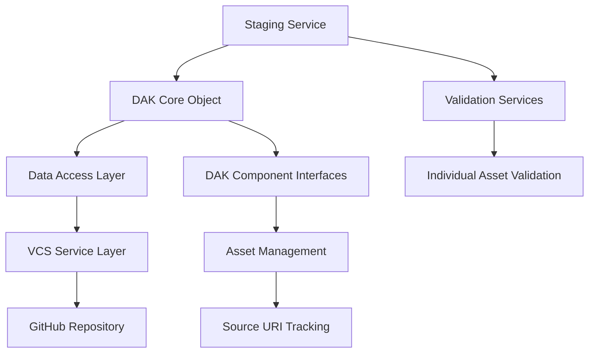

# DAK Object Architecture and VCS Integration

This document describes the architectural design for DAK object instantiation, data access layers, and Version Control System (VCS) service interactions within the SGEX Workbench ecosystem.

## Architecture Overview

The DAK architecture follows a layered approach with clear separation of concerns between core DAK objects, data access layers, and VCS services.



## Core Components

### 1. DAK Core Object

The DAK core object represents a complete Digital Adaptation Kit with access methods for all data elements in the DAK logical model.

```typescript
interface DAKObject {
  // Core identification
  id: string;
  name: string;
  version: string;
  repository: GitHubRepository;
  
  // Component access methods
  getHealthInterventions(): Promise<HealthIntervention[]>;
  getPersonas(): Promise<Persona[]>;
  getUserScenarios(): Promise<UserScenario[]>;
  getBusinessProcesses(): Promise<BusinessProcess[]>;
  getCoreDataElements(): Promise<CoreDataElement[]>;
  getDecisionLogic(): Promise<DecisionLogic[]>;
  getProgramIndicators(): Promise<ProgramIndicator[]>;
  getRequirements(): Promise<Requirement[]>;
  getDataEntryForms(): Promise<DataEntryForm[]>;
  
  // Asset manipulation methods
  addAsset(componentType: string, asset: DAKAsset): Promise<void>;
  editAsset(componentType: string, assetId: string, changes: Partial<DAKAsset>): Promise<void>;
  removeAsset(componentType: string, assetId: string): Promise<void>;
  
  // Source tracking
  getSourceURI(componentType: string, assetId: string): string;
  updateSourceURI(componentType: string, assetId: string, uri: string): void;
}
```

### 2. Data Access Layer

The data access layer provides abstraction between DAK objects and the underlying storage mechanisms (Git repositories).

```typescript
interface DAKDataAccessLayer {
  // Repository operations
  cloneRepository(owner: string, repo: string, branch?: string): Promise<DAKRepository>;
  loadSushiConfig(repository: DAKRepository): Promise<SushiConfig>;
  
  // Component loading
  loadComponent(repository: DAKRepository, componentType: DAKComponentType): Promise<Component[]>;
  loadAsset(repository: DAKRepository, assetPath: string): Promise<DAKAsset>;
  
  // Asset persistence
  saveAsset(repository: DAKRepository, assetPath: string, content: any): Promise<void>;
  deleteAsset(repository: DAKRepository, assetPath: string): Promise<void>;
  
  // Directory structure management
  ensureDirectoryStructure(repository: DAKRepository): Promise<void>;
  validateDAKStructure(repository: DAKRepository): Promise<ValidationResult>;
}
```

### 3. VCS Service Layer

The VCS service layer handles all interactions with version control systems (primarily GitHub).

```typescript
interface VCSService {
  // Repository management
  authenticate(token: string): Promise<boolean>;
  getRepository(owner: string, repo: string): Promise<GitHubRepository>;
  createBranch(owner: string, repo: string, branchName: string): Promise<GitHubBranch>;
  
  // File operations
  getFileContent(owner: string, repo: string, path: string, ref?: string): Promise<string>;
  updateFile(owner: string, repo: string, path: string, content: string, message: string): Promise<void>;
  createFile(owner: string, repo: string, path: string, content: string, message: string): Promise<void>;
  deleteFile(owner: string, repo: string, path: string, message: string): Promise<void>;
  
  // Collaboration features
  createPullRequest(owner: string, repo: string, head: string, base: string, title: string): Promise<PullRequest>;
  mergePullRequest(owner: string, repo: string, pullNumber: number): Promise<void>;
}
```

## DAK Object Instantiation Process

### 1. Repository Discovery and Validation

```typescript
class DAKFactory {
  async createDAKFromRepository(owner: string, repo: string, branch: string = 'main'): Promise<DAKObject> {
    // Step 1: Validate repository is a DAK
    const repository = await this.vcsService.getRepository(owner, repo);
    const dakValidation = await this.validateDAKRepository(repository);
    
    if (!dakValidation.isValid) {
      throw new Error(`Repository is not a valid DAK: ${dakValidation.errors.join(', ')}`);
    }
    
    // Step 2: Load sushi-config.yaml
    const sushiConfig = await this.dataAccessLayer.loadSushiConfig(repository);
    
    // Step 3: Instantiate DAK object
    const dakObject = new DAKObjectImpl(repository, sushiConfig, this.dataAccessLayer);
    
    // Step 4: Initialize component mappings
    await dakObject.initializeComponentMappings();
    
    return dakObject;
  }
  
  private async validateDAKRepository(repository: GitHubRepository): Promise<ValidationResult> {
    // Check for sushi-config.yaml existence
    try {
      const sushiConfigContent = await this.vcsService.getFileContent(
        repository.owner.login, 
        repository.name, 
        'sushi-config.yaml'
      );
      
      const sushiConfig = yaml.parse(sushiConfigContent);
      
      // Validate WHO SMART Guidelines dependency
      const hasSmartBaseDependency = sushiConfig.dependencies && 
        Object.keys(sushiConfig.dependencies).some(dep => dep.includes('smart.who.int.base'));
      
      return {
        isValid: hasSmartBaseDependency,
        errors: hasSmartBaseDependency ? [] : ['Missing smart.who.int.base dependency'],
        warnings: []
      };
    } catch (error) {
      return {
        isValid: false,
        errors: ['sushi-config.yaml not found or invalid'],
        warnings: []
      };
    }
  }
}
```

### 2. DAK Object Implementation

```typescript
class DAKObjectImpl implements DAKObject {
  private componentCache: Map<string, Component[]> = new Map();
  private sourceURIMap: Map<string, string> = new Map();
  
  constructor(
    private repository: GitHubRepository,
    private sushiConfig: SushiConfig,
    private dataAccess: DAKDataAccessLayer
  ) {}
  
  async initializeComponentMappings(): Promise<void> {
    // Map DAK components to directory structures
    const componentMappings = {
      'health-interventions': 'input/pagecontent/l2-dak.md',
      'personas': 'input/actors/',
      'user-scenarios': 'input/scenarios/',
      'business-processes': 'input/process/',
      'core-data-elements': 'input/vocabulary/',
      'decision-logic': 'input/decision-support/',
      'program-indicators': 'input/indicators/',
      'requirements': 'input/requirements/',
      'data-entry-forms': 'input/questionnaires/'
    };
    
    // Load each component type
    for (const [componentType, path] of Object.entries(componentMappings)) {
      try {
        const components = await this.dataAccess.loadComponent(this.repository, componentType as DAKComponentType);
        this.componentCache.set(componentType, components);
        
        // Track source URIs
        components.forEach(component => {
          const sourceURI = `${this.repository.html_url}/blob/main/${path}${component.filename}`;
          this.sourceURIMap.set(`${componentType}:${component.id}`, sourceURI);
        });
      } catch (error) {
        console.warn(`Failed to load component ${componentType}:`, error);
        this.componentCache.set(componentType, []);
      }
    }
  }
  
  async getBusinessProcesses(): Promise<BusinessProcess[]> {
    let processes = this.componentCache.get('business-processes') as BusinessProcess[] || [];
    
    if (processes.length === 0) {
      // Load BPMN files from repository
      const bpmnFiles = await this.dataAccess.loadComponent(this.repository, 'business-processes');
      processes = await Promise.all(bpmnFiles.map(async file => {
        const content = await this.dataAccess.loadAsset(this.repository, file.path);
        return this.parseBPMNContent(content, file);
      }));
      
      this.componentCache.set('business-processes', processes);
    }
    
    return processes;
  }
  
  async addAsset(componentType: string, asset: DAKAsset): Promise<void> {
    // Generate appropriate file path
    const filePath = this.generateAssetPath(componentType, asset);
    
    // Convert asset to appropriate format
    const content = this.serializeAsset(asset, componentType);
    
    // Save to repository
    await this.dataAccess.saveAsset(this.repository, filePath, content);
    
    // Update source URI tracking
    const sourceURI = `${this.repository.html_url}/blob/main/${filePath}`;
    this.sourceURIMap.set(`${componentType}:${asset.id}`, sourceURI);
    
    // Invalidate cache
    this.componentCache.delete(componentType);
  }
  
  async editAsset(componentType: string, assetId: string, changes: Partial<DAKAsset>): Promise<void> {
    // Load current asset
    const currentAsset = await this.getAssetById(componentType, assetId);
    if (!currentAsset) {
      throw new Error(`Asset ${assetId} not found in component ${componentType}`);
    }
    
    // Apply changes
    const updatedAsset = { ...currentAsset, ...changes };
    
    // Save updated asset
    const filePath = this.getAssetPath(componentType, assetId);
    const content = this.serializeAsset(updatedAsset, componentType);
    await this.dataAccess.saveAsset(this.repository, filePath, content);
    
    // Invalidate cache
    this.componentCache.delete(componentType);
  }
  
  getSourceURI(componentType: string, assetId: string): string {
    return this.sourceURIMap.get(`${componentType}:${assetId}`) || '';
  }
  
  updateSourceURI(componentType: string, assetId: string, uri: string): void {
    this.sourceURIMap.set(`${componentType}:${assetId}`, uri);
  }
}
```

## Staging Service Architecture

The staging service references a DAK repository, instantiates DAK objects, and manages proposed changes with validation.

```typescript
class DAKStagingService {
  private stagedChanges: Map<string, StagedChange[]> = new Map();
  private validationServices: Map<string, ValidationService> = new Map();
  
  constructor(
    private dakFactory: DAKFactory,
    private validationFactory: ValidationServiceFactory
  ) {
    this.initializeValidationServices();
  }
  
  async loadDAKRepository(owner: string, repo: string, branch: string = 'main'): Promise<DAKObject> {
    // Instantiate DAK object from repository
    const dakObject = await this.dakFactory.createDAKFromRepository(owner, repo, branch);
    
    // Initialize staging area for this DAK
    const dakKey = `${owner}/${repo}/${branch}`;
    this.stagedChanges.set(dakKey, []);
    
    return dakObject;
  }
  
  async loadAssets(dakObject: DAKObject, componentTypes: string[] = []): Promise<LoadedAssets> {
    const loadedAssets: LoadedAssets = {};
    
    // Load all components if none specified
    if (componentTypes.length === 0) {
      componentTypes = [
        'health-interventions', 'personas', 'user-scenarios', 
        'business-processes', 'core-data-elements', 'decision-logic',
        'program-indicators', 'requirements', 'data-entry-forms'
      ];
    }
    
    // Load each component type
    for (const componentType of componentTypes) {
      try {
        switch (componentType) {
          case 'business-processes':
            loadedAssets[componentType] = await dakObject.getBusinessProcesses();
            break;
          case 'personas':
            loadedAssets[componentType] = await dakObject.getPersonas();
            break;
          case 'decision-logic':
            loadedAssets[componentType] = await dakObject.getDecisionLogic();
            break;
          // ... other component types
        }
      } catch (error) {
        console.error(`Failed to load ${componentType}:`, error);
        loadedAssets[componentType] = [];
      }
    }
    
    return loadedAssets;
  }
  
  async stageChange(dakKey: string, change: StagedChange): Promise<void> {
    const changes = this.stagedChanges.get(dakKey) || [];
    changes.push(change);
    this.stagedChanges.set(dakKey, changes);
  }
  
  async validateAsset(componentType: string, asset: DAKAsset): Promise<ValidationResult> {
    const validator = this.validationServices.get(componentType);
    if (!validator) {
      return {
        isValid: true,
        errors: [],
        warnings: ['No validation service available for ' + componentType]
      };
    }
    
    return await validator.validate(asset);
  }
  
  async commitStagedChanges(dakKey: string, commitMessage: string): Promise<CommitResult> {
    const changes = this.stagedChanges.get(dakKey) || [];
    
    if (changes.length === 0) {
      return { success: false, error: 'No staged changes to commit' };
    }
    
    try {
      // Apply all staged changes
      for (const change of changes) {
        await this.applyChange(change);
      }
      
      // Clear staged changes
      this.stagedChanges.set(dakKey, []);
      
      return { success: true, changesApplied: changes.length };
    } catch (error) {
      return { success: false, error: error.message };
    }
  }
  
  private initializeValidationServices(): void {
    // Initialize validation services for each component type
    this.validationServices.set('business-processes', new BPMNValidationService());
    this.validationServices.set('decision-logic', new DMNValidationService());
    this.validationServices.set('data-entry-forms', new QuestionnaireValidationService());
    // ... other validation services
  }
}
```

## Data Flow and Dependencies

### 1. Repository to DAK Object Flow

1. **Repository Discovery**: VCS service discovers and validates DAK repositories
2. **Metadata Loading**: Data access layer loads sushi-config.yaml and component mappings
3. **Object Instantiation**: DAK factory creates DAK object with lazy-loaded components
4. **Component Population**: Components are loaded on-demand with source URI tracking

### 2. Asset Modification Flow

1. **Asset Loading**: DAK object loads specific assets through data access layer
2. **Change Staging**: Staging service tracks proposed changes without immediate persistence
3. **Validation**: Individual assets validated against component-specific rules
4. **Commit Process**: Staged changes applied to repository through VCS service

### 3. Source URI Tracking

```typescript
interface SourceURITracker {
  // Track original source of each asset
  getSourceURI(componentType: string, assetId: string): string;
  
  // Update URI when assets are moved or renamed
  updateSourceURI(componentType: string, assetId: string, newURI: string): void;
  
  // Generate GitHub blob URLs for repository assets
  generateGitHubURI(repository: GitHubRepository, filePath: string, ref?: string): string;
  
  // Maintain bidirectional mapping between assets and sources
  getAssetByURI(sourceURI: string): DAKAsset | null;
}
```

## Integration Points

### 1. MCP Service Integration

The MCP service provides REST API access to DAK objects and staging services:

```typescript
// MCP endpoints utilize DAK architecture
app.get('/dak/:owner/:repo/components/:type', async (req, res) => {
  const { owner, repo, type } = req.params;
  
  const dakObject = await stagingService.loadDAKRepository(owner, repo);
  const components = await dakObject[`get${type}`]();
  
  res.json({ components, sourceURIs: components.map(c => dakObject.getSourceURI(type, c.id)) });
});
```

### 2. External Service Dependencies

- **OCL Integration**: Core data elements link to Open Concept Lab terminology
- **PCMT Integration**: Product data elements reference Product Catalogue Management Tool
- **IRIS Integration**: Health interventions reference WHO IRIS publications

### 3. Validation Service Architecture

```typescript
interface ValidationService {
  validate(asset: DAKAsset): Promise<ValidationResult>;
  validateStructure(content: any): Promise<StructureValidationResult>;
  validateSemantics(content: any): Promise<SemanticValidationResult>;
}

class BPMNValidationService implements ValidationService {
  async validate(asset: BusinessProcess): Promise<ValidationResult> {
    const structureResult = await this.validateStructure(asset.bpmnContent);
    const semanticResult = await this.validateSemantics(asset);
    
    return {
      isValid: structureResult.isValid && semanticResult.isValid,
      errors: [...structureResult.errors, ...semanticResult.errors],
      warnings: [...structureResult.warnings, ...semanticResult.warnings]
    };
  }
}
```

This architecture provides a comprehensive foundation for DAK object management with clear separation of concerns, robust validation, and efficient VCS integration while maintaining source URI tracking throughout the asset lifecycle.